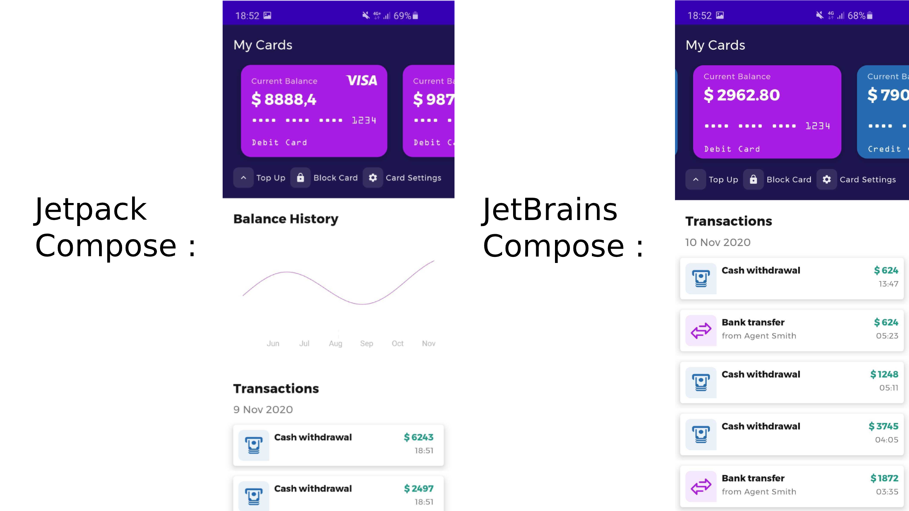

# Compose Demos
This repository is a playground for Jetpack Compose, Jetbrains Compose and Kotlin Multiplatform.

The plan is to have a few projects/apps in here with different focuses (multiplatform compose, codesharing, architecture around compose etc).

### Banking

This application uses Jetpack Compose and render a simple homescreen from a banking application. The design is inspired by
[this behance project](https://www.behance.net/gallery/79259371/Digital-banking).

*Focuses on:*
- Multiplatform Compose code-sharing (UI and Data)

#### Structure
##### `banking-android`
Android Application of the Banking Homescreen. It uses the `banking-common-data` module to fetch mock data from a Repository.

Two flavors are used to show / see the differences between a pure Android Jetpack Compose Implementation of the screen and
a Compose Implementation of the UI with Jetbrains multiplatform compose, using as little as code in the native Android module as possible.

- `jetpack`: This Flavors uses Jetpack Compose API's directly to build out the Android UI of the banking application
- `jetbrains`: This Flavors uses JetBrains Compose API's to build out the Android UI of the banking application. It is merely an Activity around
the `Home()`-Composable from the `banking-common-compose` module.

##### `banking-desktop`
Native Desktop Application of the Banking Homescreen. It uses the `banking-common-data` module to fetch mock data from a Repository.

##### `banking-common-compose`
JetBrains Compose Library Module for Desktop and Android -> Uses `banking-common-data` to render the screen for Android and Desktop.
All of the Compose code for all platforms is stored here.

##### `banking-common-data`
Kotlin Multiplatform Library: Data module with all models and a Repository for getting the mock data

#### Caveats
- Desktop App is not compiling because of this:  https://github.com/JetBrains/compose-jb/issues/76
- Cannot use ConstraintLayout, because it is not supported for Desktop yet therefore the Layouts for multiplatform compose are more verbose
- History is rendered with a Android Custom View that cannot be used in JetBrains Compose

